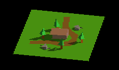
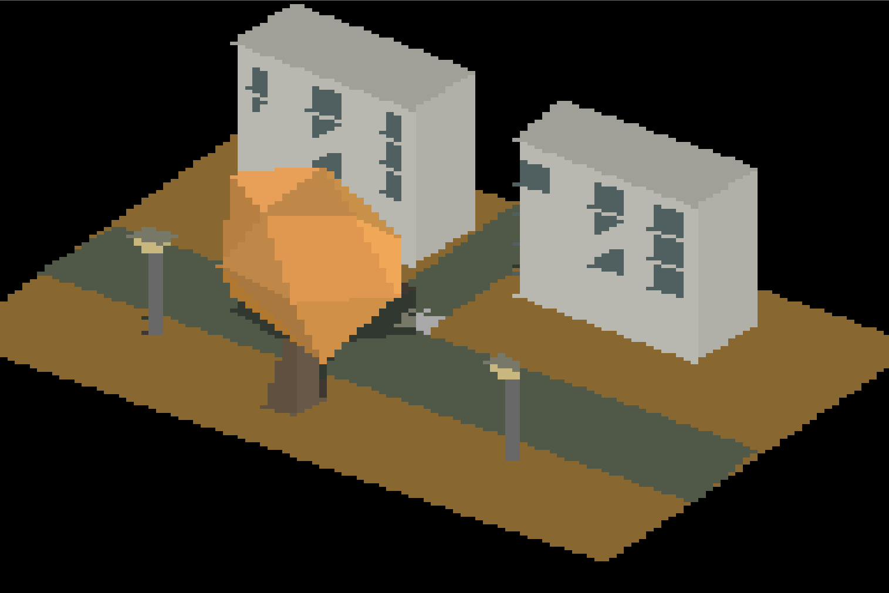

# GBA 3D Renderer

A homebrew 3D software renderer developed for Nintendo's GameBoy Advance.

# Compiling:
Download and install DevKitPro: https://github.com/devkitPro/installer/releases  
Make sure DevKitPro is added to the enviourment variables.  
Run the included make file to ouput a .gba file.  
Use an game boy advance emulater to run the .gba file. The project has been tested on no$gba.  
